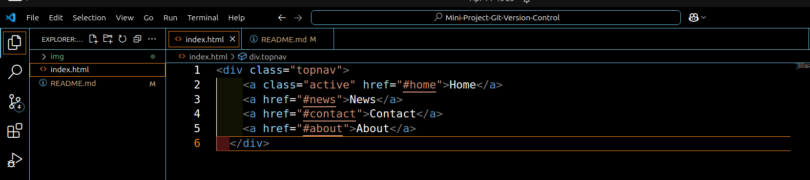
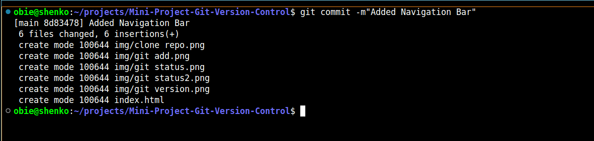
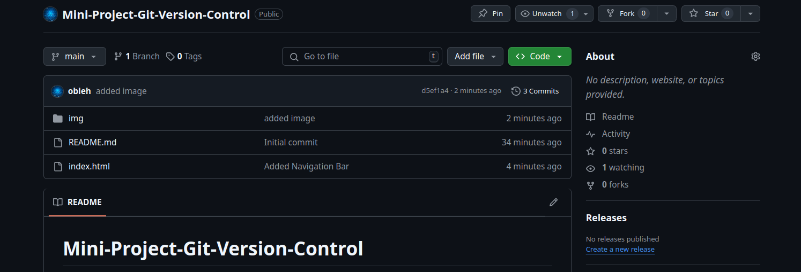

# Mini-Project-Git-Version-Control
---

## Verify git installation

` git --version`


## Initialize git on the project directory

` git init `


---
## Clone remote repository

`git clone`


---
## Add index.html and Navigation code

```html
<div class="topnav">
    <a class="active" href="#home">Home</a>
    <a href="#news">News</a>
    <a href="#contact">Contact</a>
    <a href="#about">About</a>
  </div>
```

---

## To commit changes, begin with git status to see changes made to your local repository.

`git status`


## Now you have seen the changes, use git add to add untracked changes
`git add ,`


## Check to verify if changes are now tracked with git status command

`git status`


Files in green shows changes are now been tracked

## Commit Chnages to local repository

`git commit -m'commit message'`



Changes are now commited to your local reposotory

## Push changes to remote repository

`git push`


## Verify if the changes actually got to the remote repository




